# LOGPIPE
a command-line tool called logpipe. It processes multiple large log files concurrently and
outputs aggregated results.

## HOW TO RUN
- clone the repository
- build using `go build .`
- run using the binary
```bash
\.logpipe
```
- optional flags have also been implemented
```bash
\.logpipe [--concurrency=N] file1 file2 ...
```

## TESTING RESULTS
```bash
> .\logpipe --concurrency=3 test.log  
Time taken: 1.2693ms
Total processed: 3 lines
Total malformed: 2 lines

Logs per Level
warn: 1
info: 2

Top 10 Users by Log Count:
1. alice: 1 logs
2. dave: 1 logs
```
>Testing for SIGINT
```bash
> .\logpipe --concurrency=3 test.log

SIGINT detected, shutting down gracefully...
Time taken: 0s
Total processed: 0 lines
Total malformed: 0 lines

Logs per Level

Top 10 Users by Log Count:
 
```

## IMPLEMENTATION
